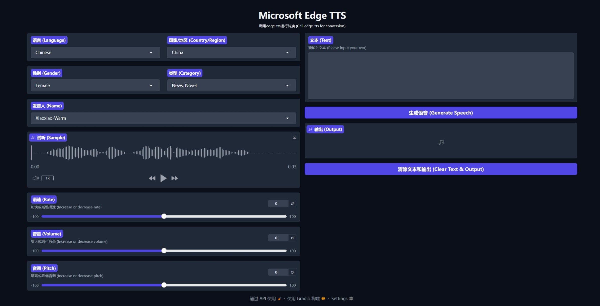

[中文](./README.md) | [EN](./README.en.md)

<div align="center">
<h1>🍦 Edge-TTS-Webui-Multilanguage</h1>
</div>

**`Edge-TTS-Webui-Multilanguage`** is a web graphical user interface version of [edge-tts](https://github.com/rany2/edge-tts), supporting 74 languages worldwide. It is developed using `Gradio`, modified based on based on [edge-tts-webui](https://github.com/ycyy/edge-tts-webui), with added features such as pitch adjustment and the inclusion of all languages listed in [tts-samples](https://github.com/yaph/tts-samples), along with sample audio for voice previews.

I am a beginner, so if there are any mistakes, please kindly point them out.




## Standard Installation

- ### Install

```
    pip install edge-tts
    pip install gradio
    pip install asyncio
```

- ### Run

```
    python tts-ui.py
```

- ### Access via browser at

```
    http://localhost:7860/
```

## Install via Docker

- ### Run the following command in the directory containing the Dockerfile

```
    docker build -t edgetts-webui-multilanguage .
```

- ### Run the container

```
    docker run -d -p 7860:7860 --name edgetts-webui-container edgetts-webui-multilanguage
```

- ### Access via browser at

```
    http://localhost:7860
```
